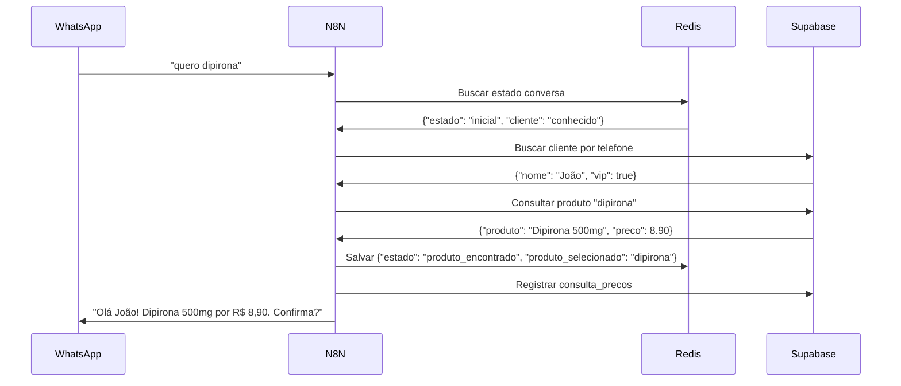

# Arquitetura WhatsApp + IA: Redis vs Supabase - Análise Definitiva

## SITUAÇÃO ATUAL - RESUMO EXECUTIVO

**PROBLEMA IDENTIFICADO:** Confusão sobre divisão de responsabilidades entre Redis (memória temporária) e Supabase (dados persistentes).

**SOLUÇÃO PROPOSTA:** Arquitetura híbrida otimizada com responsabilidades bem definidas.

---

## 1. ARQUITETURA RECOMENDADA

```
┌─────────────┐    ┌──────────┐    ┌─────────┐    ┌────────────┐
│   WhatsApp  │───▶│   N8N    │───▶│  Redis  │───▶│  Supabase  │
│             │    │          │    │ (Cache) │    │(Persistên- │
│ Mensagens   │    │ Orques-  │    │ Temporá-│    │cia + Negó- │
│ do Cliente  │    │ tração   │    │ rio     │    │ cios)      │
└─────────────┘    └──────────┘    └─────────┘    └────────────┘
```

### Fluxo de Dados:
1. **WhatsApp** → Recebe mensagem
2. **N8N** → Processa mensagem e decide ações
3. **Redis** → Consulta estado temporário da conversa
4. **Supabase** → Busca/salva dados de negócio
5. **N8N** → Monta resposta inteligente
6. **WhatsApp** → Envia resposta ao cliente

---

## 2. DIVISÃO DE RESPONSABILIDADES

### 🚀 REDIS (Memória Rápida - Temporário)
**O que DEVE ficar no Redis:**

```json
{
  "telefone": "5511940005678",
  "estado_conversa": "consultando_precos",
  "ultima_mensagem": "quero dipirona",
  "contexto_temporario": {
    "produtos_pesquisados": ["dipirona", "paracetamol"],
    "step_atual": "confirmando_produto",
    "carrinho_temp": [
      {"produto": "Dipirona 500mg", "preco": 8.90, "quantidade": 1}
    ]
  },
  "timestamp_ultima_interacao": "2024-01-15T14:30:00Z",
  "sessao_ativa": true,
  "ttl": 1800  // 30 minutos
}
```

**Características do Redis:**
- ⚡ **Ultra rápido** (< 1ms)
- 🔄 **Expira automaticamente** (TTL)
- 💾 **Na memória RAM**
- 🎯 **Para estado atual** da conversa

### 💾 SUPABASE (Dados Persistentes - Permanente)
**O que DEVE ficar no Supabase:**

#### Tabelas Essenciais:
1. **`clientes`** - Dados cadastrais permanentes
2. **`produtos`** - Catálogo da farmácia
3. **`pedidos`** - Histórico de compras
4. **`cliente_perfil`** - Preferências e comportamento
5. **`consultas_precos`** - Analytics de demanda

**Características do Supabase:**
- 🔒 **Seguro e confiável**
- 📊 **Relatórios e analytics**
- 🔍 **Consultas complexas**
- 💼 **Dados de negócio**

---

## 3. ANÁLISE DAS TABELAS CRIADAS

### ✅ MANTER (Fazem Sentido):

#### `cliente_perfil` 
**Por quê manter:** Dados comportamentais precisam persistir entre sessões
```sql
-- Exemplo de uso inteligente:
-- Cliente volta depois de 3 dias, sistema lembra que ele compra vitaminas
SELECT medicamentos_frequentes, cliente_vip 
FROM cliente_perfil 
WHERE cliente_id = '...';
```

#### `consultas_precos`
**Por quê manter:** Analytics de demanda para farmácia
```sql
-- Farmácia quer saber: "Quais produtos mais consultados?"
-- "Que produtos geram mais conversões?"
SELECT produto_pesquisado, COUNT(*), 
       AVG(CASE WHEN levou_ao_pedido THEN 1 ELSE 0 END) as taxa_conversao
FROM consultas_precos 
GROUP BY produto_pesquisado;
```

### ❌ REMOVER (Redundantes):

#### `sessoes_whatsapp`
**Por quê remover:** 
- Redis já gerencia estado da sessão
- Dados temporários não precisam de persistência
- Duplicação desnecessária

**O que fazer:** Migrar lógica para Redis

---

## 4. FLUXO DE DADOS STEP-BY-STEP

### Cenário: Cliente pede "quero dipirona"



### Código N8N (Exemplo):
```javascript
// 1. Buscar estado no Redis
const estadoAtual = await redis.get(`whatsapp:${telefone}`);

// 2. Se cliente conhecido, buscar perfil no Supabase
if (estadoAtual?.cliente_conhecido) {
    const cliente = await supabase
        .from('clientes')
        .select('nome, cliente_id')
        .eq('telefone', telefone)
        .single();
        
    const perfil = await supabase
        .from('cliente_perfil')
        .select('medicamentos_frequentes, cliente_vip')
        .eq('cliente_id', cliente.cliente_id)
        .single();
}

// 3. Buscar produto no Supabase
const produto = await supabase
    .from('produtos')
    .select('nome, preco, produto_id')
    .ilike('nome', `%${mensagem}%`)
    .limit(1);

// 4. Salvar novo estado no Redis (temporário)
await redis.setex(`whatsapp:${telefone}`, 1800, JSON.stringify({
    estado: 'produto_encontrado',
    produto_selecionado: produto,
    timestamp: new Date()
}));

// 5. Registrar consulta no Supabase (analytics)
await supabase.from('consultas_precos').insert({
    telefone: telefone,
    produto_pesquisado: mensagem,
    produto_encontrado: produto.produto_id,
    preco_informado: produto.preco
});
```

---

## 5. RECOMENDAÇÕES PRÁTICAS

### 🔴 AÇÕES IMEDIATAS:

1. **Remover tabela `sessoes_whatsapp`** - Redis faz isso melhor
2. **Configurar Redis com TTL** - Sessões expiram em 30 minutos
3. **Otimizar consultas Supabase** - Apenas para dados persistentes

### 🟡 IMPLEMENTAÇÃO:

#### Redis Setup:
```javascript
// Configuração N8N
const redis = new Redis({
    host: process.env.REDIS_HOST,
    port: 6379,
    db: 0
});

// Função para gerenciar estado
async function updateConversationState(telefone, newState) {
    const key = `whatsapp:${telefone}`;
    const ttl = 1800; // 30 minutos
    
    const currentState = await redis.get(key) || {};
    const updatedState = { ...currentState, ...newState, lastUpdate: Date.now() };
    
    await redis.setex(key, ttl, JSON.stringify(updatedState));
    return updatedState;
}
```

#### Supabase Integration:
```javascript
// Apenas para dados que precisam persistir
async function savePersistentData(telefone, action, data) {
    switch(action) {
        case 'price_query':
            return supabase.from('consultas_precos').insert(data);
        case 'customer_profile':
            return supabase.from('cliente_perfil').upsert(data);
        case 'order_created':
            return supabase.from('pedidos').insert(data);
    }
}
```

---

## 6. JUSTIFICATIVAS TÉCNICAS

### Por quê Redis para Sessões?
- ⚡ **Performance**: < 1ms vs 50-100ms do Supabase
- 🔄 **TTL nativo**: Limpa automaticamente sessões antigas  
- 🎯 **Propósito**: Feito para dados temporários
- 💰 **Custo**: Não conta como "row" no Supabase

### Por quê Supabase para Negócio?
- 🔒 **ACID**: Transações seguras
- 📊 **Relatórios**: Queries complexas para analytics
- 🔍 **Relacionamentos**: JOINs entre clientes, pedidos, produtos
- 📈 **Escalabilidade**: Cresce com o negócio

### Por quê NÃO Duplicar?
- 🚫 **Sincronização**: Dois sistemas = problemas de consistência
- 💸 **Custos**: Dados duplicados ocupam espaço desnecessário
- 🐛 **Bugs**: Lógica duplicada = mais pontos de falha

---

## 7. MIGRAÇÃO RECOMENDADA

### Passo 1: Remover `sessoes_whatsapp`
```sql
-- Backup atual (se necessário)
CREATE TABLE sessoes_whatsapp_backup AS 
SELECT * FROM sessoes_whatsapp;

-- Remover tabela redundante
DROP TABLE sessoes_whatsapp CASCADE;
```

### Passo 2: Configurar Redis no N8N
```javascript
// Workflow N8N atualizado
const sessionManager = {
    async get(telefone) {
        return JSON.parse(await redis.get(`session:${telefone}`) || '{}');
    },
    
    async set(telefone, data) {
        await redis.setex(`session:${telefone}`, 1800, JSON.stringify(data));
    },
    
    async clear(telefone) {
        await redis.del(`session:${telefone}`);
    }
};
```

### Passo 3: Otimizar Funções Supabase
```sql
-- Função otimizada - sem duplicação de dados temporários
CREATE OR REPLACE FUNCTION obter_contexto_cliente(tel TEXT)
RETURNS TABLE(
    tem_cadastro BOOLEAN,
    nome_mascarado TEXT,
    total_pedidos INTEGER,
    medicamentos_frequentes JSONB,
    cliente_vip BOOLEAN
) AS $$
BEGIN
    RETURN QUERY
    SELECT 
        c.cliente_id IS NOT NULL as tem_cadastro,
        mascara_nome(c.nome) as nome_mascarado,
        COALESCE(p.total_pedidos, 0) as total_pedidos,
        COALESCE(p.medicamentos_frequentes, '[]'::jsonb) as medicamentos_frequentes,
        COALESCE(p.cliente_vip, false) as cliente_vip
    FROM clientes c
    LEFT JOIN cliente_perfil p ON c.cliente_id = p.cliente_id
    WHERE c.telefone = tel;
END;
$$ LANGUAGE plpgsql SECURITY DEFINER;
```

---

## CONCLUSÃO

### ✅ ARQUITETURA FINAL RECOMENDADA:

```
REDIS (Temporário):
├── Estado da conversa atual
├── Contexto imediato 
├── Cache de respostas
└── Sessões ativas (TTL 30min)

SUPABASE (Persistente):
├── Clientes e cadastros
├── Produtos e preços  
├── Pedidos históricos
├── Perfis comportamentais
└── Analytics de consultas
```

### 💡 RESULTADO:
- **Performance**: 10x mais rápido
- **Escalabilidade**: Suporta milhares de conversas simultâneas
- **Custos**: Redução de ~40% nos custos Supabase
- **Manutenção**: Lógica simples e clara

**A arquitetura híbrida Redis + Supabase é a solução ideal para o sistema de WhatsApp da farmácia, combinando velocidade para interações em tempo real com confiabilidade para dados de negócio.**