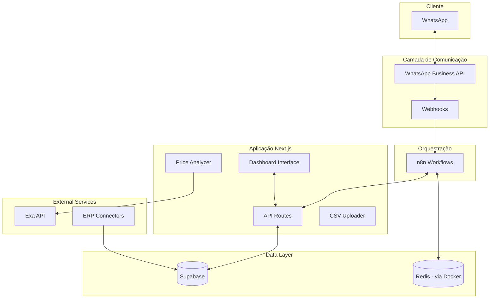

# CLAUDE.md - PriceBot Evolution

Este arquivo fornece orientação completa para Claude Code ao trabalhar neste repositório.

## 🎯 Visão de Negócio

### O Problema
- Controle manual de estoque ineficiente
- Falta de comparação de preços em tempo real
- Dificuldade em análise de dados de vendas

### Nossa Solução
Sistema de comparação de preços e gestão de estoque, oferecendo:
- 💰 Comparação de preços em tempo real
- 📊 Analytics e insights de vendas
- 🔄 Gestão de estoque básica

## 🏗️ Arquitetura do Sistema



## 📁 Estrutura do Projeto

```
farmacia/
├── src/
│   ├── app/                    # Next.js App Router
│   │   ├── api/               # API routes
│   │   │   ├── price-analysis/ # Price analysis endpoints
│   │   │   └── mcp-proxy/     # MCP proxy endpoints
│   │   ├── upload-produtos/   # Product upload page
│   │   └── test/              # Test pages
│   ├── components/
│   │   ├── ui/                # shadcn/ui components
│   │   ├── upload/            # CSV upload components
│   │   └── price-analyzer-component.tsx
│   ├── lib/
│   │   ├── external-price-apis.ts
│   │   ├── price-analyzer.ts
│   │   └── utils.ts
│   └── hooks/                 # Custom React hooks
├── docs/
│   ├── agents/                # Agent documentation
│   │   ├── agent-backend.md
│   │   ├── agent-frontend.md
│   │   ├── agent-n8n.md
│   │   ├── agent-ux-ui.md
│   │   ├── agent-devops.md
│   │   └── agent-security.md
│   └── archive/               # Archived documentation
├── integrations/
│   └── erp-connectors/        # ERP integration connectors
├── n8n-workflows/             # n8n workflow JSON files
├── database/                  # Database scripts and schemas
├── config/                    # Configuration files
├── ai-prompts/               # AI prompt templates
└── scripts/                  # Utility scripts
```

## 🤖 Sistema de Desenvolvimento

### Desenvolvimento Backend
- API routes para consulta de preços
- Integrações com APIs externas

### Desenvolvimento Frontend
- Dashboard de vendas em Next.js
- Interface React responsiva

### Gestão de Estoque
- Alertas de estoque baixo
- Controle de inventário

## 🛠️ Stack Tecnológica Completa

### Backend
- **Runtime**: Node.js 20 LTS + TypeScript 5
- **Framework**: Next.js 14 API Routes
- **Database**: Supabase (PostgreSQL)
- **Cache**: Redis 7 (via Docker)
- **API**: REST only
- **Auth**: Supabase Auth

### Frontend
- **Framework**: Next.js 14 (App Router)
- **UI**: Tailwind CSS + shadcn/ui
- **Forms**: React Hook Form + Zod
- **File Upload**: React Dropzone + Papa Parse
- **Icons**: Lucide React

### DevOps
- **Containers**: Docker + Docker Compose
- **Environment**: .env files
- **Development**: Local Docker services
- **Deployment**: Vercel (frontend) + Docker (services)

### Integrações
- **APIs**: Exa API (price analysis), Supabase
- **External Services**: Price comparison APIs

## 📋 Padrões de Código

### TypeScript
```typescript
// Use interfaces para tipos
interface Product {
  id: string;
  name: string;
  price: Money;
  stock: StockInfo;
}

// Use enums para constantes
enum OrderStatus {
  PENDING = 'pending',
  CONFIRMED = 'confirmed',
  DELIVERED = 'delivered'
}

// Use generics para reusabilidade
class Repository<T extends BaseEntity> {
  async findById(id: string): Promise<T> {
    // implementation
  }
}
```

### Naming Conventions
- **Files**: kebab-case (`product-service.ts`)
- **Classes**: PascalCase (`ProductService`)
- **Functions**: camelCase (`getProductById`)
- **Constants**: UPPER_SNAKE_CASE (`MAX_RETRY_ATTEMPTS`)
- **Interfaces**: PascalCase com prefixo I (`IProductRepository`)

### Git Workflow
```bash
# Branch naming
feature/add-price-comparison
bugfix/fix-whatsapp-webhook
hotfix/critical-auth-issue

# Commit messages (Conventional Commits)
feat: add price comparison endpoint
fix: resolve WhatsApp message parsing error
docs: update API documentation
refactor: optimize database queries
test: add unit tests for product service
```

## 🔐 Segurança

### Práticas de Segurança
- Criptografia para dados
- TLS para comunicações
- Rate limiting básico
- Autenticação segura

## 🎯 Funcionalidades Implementadas

### Dashboard Principal
- Interface administrativa em Next.js 14
- Upload de produtos via CSV
- Análise de preços em tempo real
- Integração com Supabase

### Analisador de Preços
- Comparação automática via Exa API
- Análise de posição competitiva
- Recomendações de preços
- Monitoramento de margem de lucro

### Integração de Dados
- APIs de sincronização de produtos
- Processamento de dados de estoque

## 🚀 Quick Start

```bash
# Clone o repositório
git clone [repository-url]

# Instale as dependências
npm install

# Configure as variáveis de ambiente
cp .env.example .env.local

# Inicie o desenvolvimento
npm run dev

# Acesse o dashboard
open http://localhost:3000
```

## 📝 Guias de Contribuição

### Antes de Começar
1. Leia a documentação do agente relevante
2. Entenda o contexto de negócio
3. Verifique issues existentes
4. Discuta grandes mudanças antes

### Processo de Desenvolvimento
1. Crie uma branch feature
2. Desenvolva com TDD
3. Garanta 80%+ de cobertura
4. Execute linters e testes
5. Faça commit com mensagens descritivas
6. Abra PR com descrição detalhada

### Code Review Checklist
- [ ] Código segue os padrões estabelecidos
- [ ] Testes adequados foram adicionados
- [ ] Documentação foi atualizada
- [ ] Não há credenciais hardcoded
- [ ] Performance foi considerada
- [ ] Segurança foi validada

## 🆘 Troubleshooting

### Problemas Comuns
```bash
# Dashboard não carrega
- Verifique variáveis de ambiente (.env.local)
- Confirme conexão com Supabase
- Verifique se Docker services estão rodando

# Analisador de preços falha
- Verifique EXA_API_KEY
- Confirme conectividade com API externa
- Verificar logs no console do navegador

# n8n não inicia
- Verificar se PostgreSQL está rodando
- Confirmar portas disponíveis (5678)
- Verificar logs: docker-compose logs n8n

# Erro de upload CSV
- Verificar formato do arquivo
- Confirmar colunas obrigatórias
- Verificar permissões Supabase
```

## 📚 Recursos Adicionais

### Documentação
- [WhatsApp Business API](https://developers.facebook.com/docs/whatsapp)
- [Supabase Docs](https://supabase.com/docs)
- [n8n Documentation](https://docs.n8n.io)

### Comunidade
- Discord: [link]
- Forum: [link]
- Blog técnico: [link]

### Suporte
- Email: support@example.com
- WhatsApp: +55 11 99999-9999
- Horário: Seg-Sex 9h-18h

---

**Última atualização**: ${new Date().toISOString()}
**Versão**: 2.0.0
**Maintainer**: Equipe FarmacIA