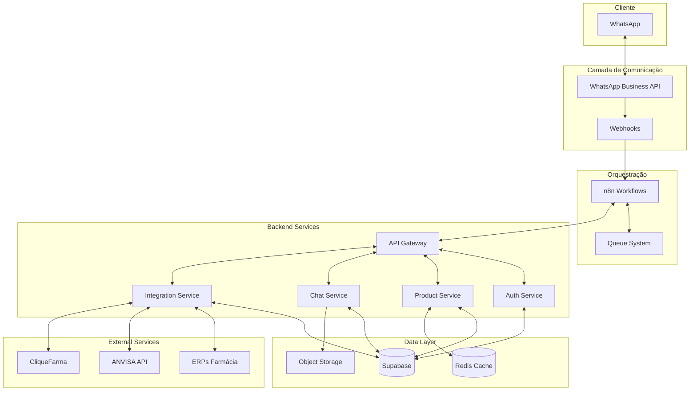

# CLAUDE.md - FarmaBot Pro Evolution

Este arquivo fornece orientação completa para Claude Code ao trabalhar neste repositório.

## 🎯 Visão de Negócio

### O Problema
- **70% das pequenas farmácias** ainda usam controle manual de estoque
- **92% dos idosos** (principal cliente) usam WhatsApp diariamente  
- **Perda de 15-30% em vendas** por falta de atendimento 24/7
- **Competição desleal** com grandes redes em preços

### Nossa Solução
Sistema integrado de atendente virtual que transforma pequenas farmácias em negócios digitais competitivos, oferecendo:
- 🤖 Atendimento 24/7 via WhatsApp
- 💰 Comparação de preços em tempo real
- 📊 Analytics e insights de vendas
- 🔄 Integração com ERPs existentes

## 🏗️ Arquitetura do Sistema



## 📁 Estrutura do Projeto

```
farmabot-pro/
├── apps/
│   ├── api/                    # Backend API (NestJS)
│   ├── dashboard/              # Frontend Dashboard (Next.js 14)
│   ├── mobile/                 # Mobile App (React Native)
│   └── chatbot/                # Chatbot Logic
├── packages/
│   ├── shared/                 # Shared types & utilities
│   ├── ui/                     # Design system components
│   └── database/               # Database schemas & migrations
├── infrastructure/
│   ├── docker/                 # Docker configurations
│   ├── k8s/                    # Kubernetes manifests
│   └── terraform/              # Infrastructure as Code
├── n8n/
│   ├── workflows/              # n8n workflow definitions
│   ├── nodes/                  # Custom n8n nodes
│   └── credentials/            # Credential templates
├── docs/
│   ├── agents/                 # Agent documentation
│   ├── api/                    # API documentation
│   └── guides/                 # User guides
└── tests/
    ├── e2e/                    # End-to-end tests
    ├── integration/            # Integration tests
    └── unit/                   # Unit tests
```

## 🤖 Sistema de Agentes Especializados

### Hierarquia de Agentes
1. **Master Agent** - Coordena todos os outros agentes
2. **Domain Agents** - Especialistas em áreas específicas
   - `agent-backend.md` - Desenvolvimento backend
   - `agent-frontend.md` - Desenvolvimento frontend
   - `agent-n8n.md` - Automações e workflows
   - `agent-ux-ui.md` - Design e experiência
   - `agent-devops.md` - Infraestrutura e deploy
   - `agent-security.md` - Segurança e compliance

### Como Usar os Agentes
```bash
# Para tarefas de backend
@agent-backend criar endpoint para consulta de preços

# Para tarefas de frontend
@agent-frontend implementar dashboard de vendas

# Para automações
@agent-n8n criar workflow de alerta de estoque

# Para melhorias de UX
@agent-ux-ui otimizar fluxo de checkout
```

## 🛠️ Stack Tecnológica Completa

### Backend
- **Runtime**: Node.js 20 LTS + TypeScript 5.3
- **Framework**: NestJS (microservices architecture)
- **Database**: Supabase (PostgreSQL 15)
- **Cache**: Redis 7
- **Queue**: BullMQ
- **API**: GraphQL + REST
- **Auth**: Supabase Auth + JWT

### Frontend
- **Framework**: Next.js 14 (App Router)
- **UI**: Tailwind CSS + shadcn/ui
- **State**: Zustand + React Query
- **Charts**: Recharts + D3.js
- **Mobile**: React Native + Expo

### DevOps
- **Containers**: Docker + Docker Compose
- **Orchestration**: Kubernetes
- **CI/CD**: GitHub Actions
- **Monitoring**: Prometheus + Grafana
- **Logging**: ELK Stack

### Integrações
- **WhatsApp**: Official Business API
- **n8n**: Self-hosted automation
- **ERPs**: Vetor, Digifarma, TekFarma
- **APIs**: ANVISA, CliqueFarma, ConsultaRemédios

## 📋 Padrões de Código

### TypeScript
```typescript
// Use interfaces para tipos
interface Product {
  id: string;
  name: string;
  price: Money;
  stock: StockInfo;
}

// Use enums para constantes
enum OrderStatus {
  PENDING = 'pending',
  CONFIRMED = 'confirmed',
  DELIVERED = 'delivered'
}

// Use generics para reusabilidade
class Repository<T extends BaseEntity> {
  async findById(id: string): Promise<T> {
    // implementation
  }
}
```

### Naming Conventions
- **Files**: kebab-case (`product-service.ts`)
- **Classes**: PascalCase (`ProductService`)
- **Functions**: camelCase (`getProductById`)
- **Constants**: UPPER_SNAKE_CASE (`MAX_RETRY_ATTEMPTS`)
- **Interfaces**: PascalCase com prefixo I (`IProductRepository`)

### Git Workflow
```bash
# Branch naming
feature/add-price-comparison
bugfix/fix-whatsapp-webhook
hotfix/critical-auth-issue

# Commit messages (Conventional Commits)
feat: add price comparison endpoint
fix: resolve WhatsApp message parsing error
docs: update API documentation
refactor: optimize database queries
test: add unit tests for product service
```

## 🔐 Segurança e Compliance

### Requisitos Legais
- **LGPD**: Proteção de dados pessoais
- **ANVISA**: Regulamentação de medicamentos
- **SNGPC**: Sistema Nacional de Gerenciamento de Produtos Controlados
- **CRF**: Conselho Regional de Farmácia

### Práticas de Segurança
- Criptografia AES-256 para dados sensíveis
- TLS 1.3 para todas as comunicações
- Rate limiting e DDoS protection
- Audit logs para todas as operações
- Princípio do menor privilégio
- Autenticação multifator para admins

## 📊 Métricas de Sucesso

### KPIs Técnicos
- **Uptime**: > 99.9%
- **Response Time**: < 200ms (p95)
- **Error Rate**: < 0.1%
- **Queue Processing**: < 5s

### KPIs de Negócio
- **Taxa de Conversão**: > 15%
- **Tempo de Resposta Bot**: < 2s
- **Satisfação do Cliente**: > 4.5/5
- **Redução de Custos**: > 40%

## 🚀 Quick Start

```bash
# Clone o repositório
git clone https://github.com/seu-org/farmabot-pro.git

# Instale as dependências
npm install

# Configure as variáveis de ambiente
cp .env.example .env

# Inicie os serviços com Docker
docker-compose up -d

# Execute as migrações
npm run db:migrate

# Inicie o desenvolvimento
npm run dev

# Acesse o dashboard
open http://localhost:3000

# Acesse o n8n
open http://localhost:5678
```

## 📝 Guias de Contribuição

### Antes de Começar
1. Leia a documentação do agente relevante
2. Entenda o contexto de negócio
3. Verifique issues existentes
4. Discuta grandes mudanças antes

### Processo de Desenvolvimento
1. Crie uma branch feature
2. Desenvolva com TDD
3. Garanta 80%+ de cobertura
4. Execute linters e testes
5. Faça commit com mensagens descritivas
6. Abra PR com descrição detalhada

### Code Review Checklist
- [ ] Código segue os padrões estabelecidos
- [ ] Testes adequados foram adicionados
- [ ] Documentação foi atualizada
- [ ] Não há credenciais hardcoded
- [ ] Performance foi considerada
- [ ] Segurança foi validada

## 🆘 Troubleshooting

### Problemas Comuns
```bash
# WhatsApp webhook não recebe mensagens
- Verifique o token de verificação
- Confirme o webhook URL no Meta Business

# n8n não processa workflows
- Verifique as credenciais
- Confirme conexão com Supabase

# Dashboard não carrega dados
- Verifique CORS settings
- Confirme API keys do Supabase
```

## 📚 Recursos Adicionais

### Documentação
- [WhatsApp Business API](https://developers.facebook.com/docs/whatsapp)
- [Supabase Docs](https://supabase.com/docs)
- [n8n Documentation](https://docs.n8n.io)

### Comunidade
- Discord: [link]
- Forum: [link]
- Blog técnico: [link]

### Suporte
- Email: suporte@farmabot.pro
- WhatsApp: +55 11 99999-9999
- Horário: Seg-Sex 9h-18h

---

**Última atualização**: ${new Date().toISOString()}
**Versão**: 2.0.0
**Maintainer**: Equipe FarmaBot Pro