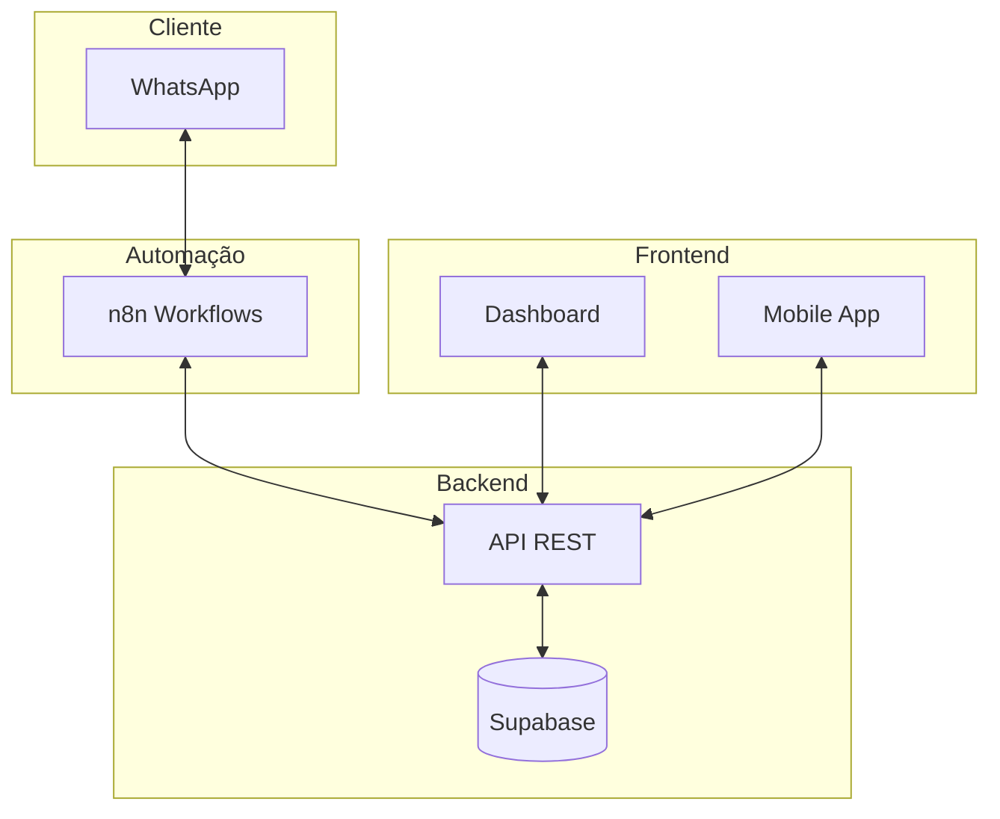

# 🤖 PriceBot - Sistema de Comparação

## 🎯 Visão Geral

**PriceBot** é um sistema de comparação de preços e gestão de inventário, utilizando Next.js e Supabase como banco de dados. O sistema oferece análise de preços em tempo real e gestão de estoque.

### 🌟 Principais Funcionalidades

- 💰 **Comparação de Preços**: Integração com APIs de preços
- 📊 **Dashboard Analytics**: Métricas em tempo real
- 📱 **Interface Web**: Dashboard responsivo
- 🔄 **Gestão de Estoque**: Controle básico de inventário
- 📈 **Relatórios**: Análises de vendas

## 🏗️ Arquitetura



## 🚀 Quick Start

### 1. Pré-requisitos

- Node.js 18+ 
- npm 8+
- Docker e Docker Compose
- Conta Supabase (gratuita)
- WhatsApp Business API

### 2. Instalação Rápida

```bash
# Clone o repositório
git clone https://github.com/farmabot-pro/farmabot-system.git
cd farmabot-system

# Instale dependências
npm install

# Configure o banco de dados
npm run db:setup

# Inicie todos os serviços
npm run docker:up

# Inicie o desenvolvimento
npm run dev
```

### 3. Configuração Manual

#### 3.1 Banco de Dados (Supabase)

1. **Criar Projeto**: https://supabase.com
2. **Executar SQL**: Copie e execute os arquivos em `/database/`
3. **Configurar .env**: Adicione suas credenciais

```bash
cp .env.example .env.local
# Edite .env.local com suas credenciais
```

#### 3.2 WhatsApp Business API

1. **Meta Business**: Crie conta em business.facebook.com
2. **WhatsApp Business API**: Configure aplicação
3. **Webhook**: Configure endpoint para receber mensagens
4. **Credenciais**: Adicione no .env.local

#### 3.3 n8n (Automação)

```bash
# Iniciar n8n
docker-compose up -d n8n

# Acesse: http://localhost:5678
# Importe workflows da pasta /n8n/workflows/
```

## 📁 Estrutura do Projeto 